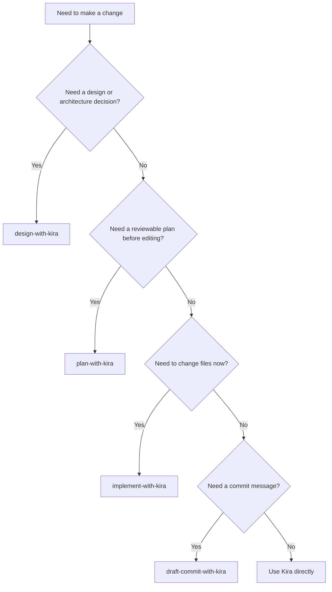

# Kira Change Flow

This is the current reusable flow for making changes in this repository.

## Choose the Lane

## Lane Guide

### `design-with-kira`

Use this when you need an ADR, tradeoff analysis, proposal review, or a design decision before coding.

- Backing skill: `kira-architecture`
- Best for: choosing between options, pressure-testing a plan, drafting design docs
- Output shape: decision, recommendation, or review

### `plan-with-kira`

Use this when the work is ticket-like or you want a reviewable implementation plan before editing.

- Backing skills: `kira-ticket-intake` then `kira-architecture`
- Best for: feature planning, refactors, multi-step work, risky changes
- Output shape: implementation plan with sequence, risks, validation, and open questions

### `implement-with-kira`

Use this when you already know the task and want the repo changed and validated.

- Backing skill: `kira-implementation-workflow`
- Best for: bug fixes, features, refactors, tests, and targeted file edits
- Output shape: changed files, validation, and any remaining unknowns

When editing C# files, apply `kira-csharp-conventions` only while editing, not during analysis or review.

### `draft-commit-with-kira`

Use this when you need a staged, squash, or merge commit message without creating the commit.

- Backing skill: `kira-draft-commit-message`
- Best for: naming the change after the work is already done
- Output shape: a final commit message only

### Direct `Kira` review

There is no dedicated review prompt in the current surface, so review work goes through Kira directly.

- Backing skill: `kira-review`
- Best for: PRs, branches, and diffs where findings must come first
- Output shape: findings ordered by severity, then any assumptions or gaps

## Change Checklist

Use this sequence when you are making repo changes:

1. Start from the nearest concrete file, symbol, failing behavior, or command.
2. Choose the narrowest lane that matches the task.
3. Make the smallest grounded change that tests the current path.
4. Validate the touched scope before widening the work.
5. Report what changed, what was validated, and what remains open.

## Notes

- Shared skills are the canonical workflow layer behind prompts and Kira.
- Prompts are just entrypoints; they should stay thin.
- Keep new lanes rare. Add one only when it represents a genuinely distinct user action.