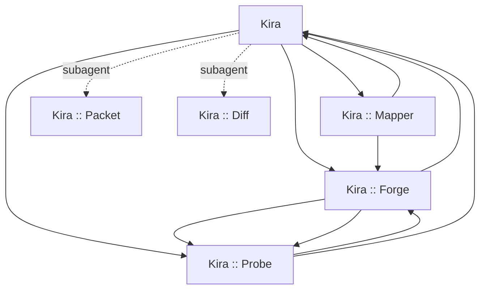

# Kira Workflow Asset Map

- Date: 2026-05-29
- Status: Draft implementation map
- Purpose: lock the `copilot/` asset set, names, model tiers, and privilege envelopes before authoring the customization pack.

## Fixed decisions

- Ship one visible coordinator agent named `Kira`.
- Ship hidden worker agents named `Kira :: <function>`.
- Use geek-flavored function names that still describe the job.
- Keep prompts focused on single drafting tasks; do not create a `/plan` replacement.
- Keep instructions linkable and scoped; avoid large always-on instruction payloads.
- Default drafting outputs to fenced markdown blocks.
- Keep `Kira` on a low-cost default model.
- Use handoffs only for visible agents.
- Use hidden agents only as subagent helpers, not as handoff targets.
- Do not rely on hidden subagents to raise the model tier; higher-cost reasoning belongs on visible specialist agents that users reach explicitly or through handoff.

## Proposed repository tree

```text
copilot/
  agents/
    kira.agent.md
    kira-packet.agent.md
    kira-mapper.agent.md
    kira-forge.agent.md
    kira-probe.agent.md
    kira-diff.agent.md
  instructions/
    kira-core.instructions.md
    kira-drafting.instructions.md
    kira-csharp.instructions.md
  prompts/
    kira-create-adr.prompt.md
    kira-create-analysis.prompt.md
    kira-draft-commit.prompt.md
    kira-draft-pr.prompt.md
    kira-draft-ticket.prompt.md
    kira-refactor.prompt.md
  skills/
    kira-ticket-intake/
      SKILL.md
    kira-change-docs/
      SKILL.md
```

## Routing model

- `Kira` stays read-only.
- Visible routing: `Kira` hands off to visible specialist agents for planning, implementation, and testing.
- Hidden routing: only cheap helper agents run as subagents behind the scenes for packetization.
- Handoffs never target hidden agents.
- Custom subagents can request their own model, but they cannot exceed the active parent model tier, so hidden workers should be same-tier or cheaper helpers rather than the place where premium reasoning lives.

## Agent map

### `copilot/agents/kira.agent.md`

- Display name: `Kira`
- Visibility: visible in picker
- Model: `GPT-5 mini (copilot)`
- Tool envelope: `read`, `#search`, `#problems`, `agent`
- Subagent access: `Kira :: Packet`, `Kira :: Diff`
- Handoffs:
  - `Plan Change` -> `Kira :: Mapper`
  - `Implement Approved Change` -> `Kira :: Forge`
  - `Validate With Tests` -> `Kira :: Probe`
- Responsibilities:
  - accept a ticket, plan, request, file, or direct question
  - read `todo.md`, attached files, and local docs to understand backlog or requirements
  - answer basic questions directly when no specialist workflow is needed
  - dispatch the hidden packet helper only for cheap helper work
  - use `Kira :: Diff` inline when a direct drafting path is shorter than routing through `Kira`
  - hand off to visible specialists when the task needs deeper reasoning, editing, or testing discipline
  - never implement through terminal or direct file edits
  - enforce strict markdown and drafting rules
  - keep context lean and avoid duplicate explanations
- Output contract:
  - plain answers stay concise markdown
  - draft artifacts are returned in fenced blocks
  - specialist workflows end with validation status and the next visible handoff when applicable

### `copilot/agents/kira-packet.agent.md`

- Display name: `Kira :: Packet`
- Visibility: hidden worker only
- Model: `GPT-5 mini (copilot)`
- Tool envelope: `#search`, `terminal`, optional `#web`
- Responsibilities:
  - intake GitHub tickets through `gh`
  - intake Azure DevOps work items through `az` plus Azure DevOps extension when available
  - normalize ticket data into one markdown packet
  - extract title, context, acceptance criteria, linked artifacts, risks, and open questions
- Output contract:
  - always one fenced markdown block titled `Ticket Packet`
  - include a `Missing Inputs` section when CLI access or fields are unavailable
- Return mode: return the normalized packet to the caller; do not use handoffs

### `copilot/agents/kira-mapper.agent.md`

- Display name: `Kira :: Mapper`
- Visibility: visible in picker and valid handoff target
- Model: `GPT-5.4 (copilot)`
- Tool envelope: `#search`, `#problems`
- Responsibilities:
  - create implementation plans from a ticket, request, or normalized packet
  - draft ADR content and analysis notes before coding starts
  - define validation steps, risks, rollback notes, and unanswered questions
  - refuse broad implementation when requirements are still ambiguous
- Output contract:
  - plan section
  - ADR draft section in fenced block when requested
  - analysis draft section in fenced block when requested
- Handoffs:
  - `Kira :: Forge` for implementation
  - `Kira` when the user wants delivery-ready drafting from the planning output

### `copilot/agents/kira-forge.agent.md`

- Display name: `Kira :: Forge`
- Visibility: visible in picker and valid handoff target
- Model: `GPT-5.3-Codex (copilot)`
- Tool envelope: `#search`, `#edit`, `#problems`, `terminal`
- Responsibilities:
  - implement approved plans or directly scoped requests
  - perform bounded refactors from a file, request, or plan
  - make the smallest change that proves the behavior
  - run narrow validation immediately after the first meaningful edit
- Output contract:
  - short change summary
  - exact validation command and result
  - unresolved blockers if validation fails
- Handoffs:
  - `Kira :: Probe` for test and coverage follow-up
  - `Kira` when the implementation is ready for delivery drafting

### `copilot/agents/kira-probe.agent.md`

- Display name: `Kira :: Probe`
- Visibility: visible in picker and valid handoff target
- Model: `GPT-5.4 mini (copilot)`
- Tool envelope: `#search`, `#edit`, `#problems`, `terminal`
- Responsibilities:
  - add or update unit tests for the changed slice
  - discover and run the narrowest relevant test command
  - discover coverage support and validate it when the repo exposes a command
  - say explicitly when coverage cannot be validated from the current repo tooling
- Output contract:
  - test additions summary
  - executed test command
  - coverage command and threshold result, or a clear note that coverage support is absent
- Handoffs:
  - `Kira :: Forge` when test failures require code changes
  - `Kira` when validated output should be turned into delivery artifacts

### `copilot/agents/kira-diff.agent.md`

- Display name: `Kira :: Diff`
- Visibility: visible in picker and directly callable from prompt frontmatter
- Model: `GPT-5 mini (copilot)`
- Tool envelope: `#search`, `terminal`
- Responsibilities:
  - draft commit messages from the current worktree by default
  - draft pull request descriptions from branch vs parent comparison
  - draft ticket updates from a request, plan, or implemented diff
  - keep output short, structured, and copy-paste ready
- Output contract:
  - commit drafts always use fenced code blocks and Conventional Commits shape
  - PR drafts always use one fenced markdown block
  - ticket drafts always use one fenced markdown block
- Use mode: callable directly or by `Kira` when that is the shorter path

## Why there is no extra Q and A agent

Basic questions stay with `Kira`.

That avoids an unnecessary worker, reduces prompt duplication, and preserves the persona in lightweight sessions. The specialized workers exist only where tool scope, output contract, or cost profile changes materially.

## Prompt map

Prompts stay narrow and text-first. They should not override tool access unless the task genuinely needs a tighter tool list than the active agent already provides. Use prompt frontmatter to pin the intended installed agent.

### `copilot/prompts/kira-create-adr.prompt.md`

- Goal: turn a ticket, plan, or change request into an ADR draft
- Agent frontmatter: `Kira :: Mapper`
- Output: one fenced markdown block with context, decision, consequences, and validation notes

### `copilot/prompts/kira-create-analysis.prompt.md`

- Goal: create an analysis note before implementation
- Agent frontmatter: `Kira :: Mapper`
- Output: one fenced markdown block with problem statement, assumptions, options, recommendation, and risks

### `copilot/prompts/kira-draft-commit.prompt.md`

- Goal: draft a commit message from the current worktree unless the user supplies a narrower diff
- Agent frontmatter: `Kira :: Diff`
- Output: one fenced text block using Conventional Commits 1.0.0 layout

### `copilot/prompts/kira-draft-pr.prompt.md`

- Goal: draft a pull request description from branch vs parent diff
- Agent frontmatter: `Kira :: Diff`
- Output: one fenced markdown block with summary, changes, validation, and risk
- Default comparison rule: upstream tracking branch first, default branch second

### `copilot/prompts/kira-draft-ticket.prompt.md`

- Goal: draft ticket content or an update from a request, plan, or implemented change
- Agent frontmatter: `Kira :: Diff`
- Output: one fenced markdown block with title, summary, acceptance criteria, and rollout notes when relevant

### `copilot/prompts/kira-refactor.prompt.md`

- Goal: refactor from a request, plan, or explicit file scope
- Agent frontmatter: `Kira :: Forge`
- Output: concise plan plus implementation request with validation expectations

Note: because the source files live under `copilot/` instead of the default workspace discovery folders, prompt-editor diagnostics in this repository may not resolve the custom agent names until the assets are installed.

## Skill map

### `copilot/skills/kira-ticket-intake/SKILL.md`

- Purpose: reusable intake workflow for GitHub issues and Azure DevOps work items
- Why a skill: it needs a repeatable multi-step workflow, CLI command templates, and a normalized output schema
- Bundled behavior:
  - ask which source system to use
  - gather the minimal identifiers needed for `gh` or `az`
  - emit a normalized ticket packet
  - flag authentication or missing-extension blockers without guessing

### `copilot/skills/kira-change-docs/SKILL.md`

- Purpose: reusable workflow for ADR and analysis document generation
- Why a skill: it packages the document schema and decision checklist without inflating the main agent prompt
- Bundled behavior:
  - accept ticket, plan, or request input
  - produce ADR draft and analysis draft using the same structure each time
  - keep drafts compact and ready to paste into a repo-local doc

## Instruction map

Instructions should be linked from agents and prompts instead of loaded globally with a wide `applyTo`. That keeps repeated token cost down. Repo-local `copilot-instructions.md` still wins when present, with installed Kira instructions as the fallback.

### `copilot/instructions/kira-core.instructions.md`

- Scope: Kira identity, naming rules, output format rules, and direct-answer behavior
- Key content:
  - Kira introduces itself as Kira unless platform context matters
  - workers are named `Kira :: <function>`
  - direct answers stay concise markdown
  - draft artifacts always use fenced blocks

### `copilot/instructions/kira-core.instructions.md`

- Scope: workflow routing and repo-aware defaults
- Key content:
  - accept ticket, plan, request, or file scope
  - commit drafts use current worktree by default
  - PR drafts compare branch vs parent
  - validation order is narrow test, then broader checks only when needed
  - coverage claims require an actual repo command

### `copilot/instructions/kira-cost-routing.instructions.md`

- Scope: model and token discipline
- Key content:
  - answer simple questions directly when tools are unnecessary
  - prefer small context windows and minimal repeated boilerplate
  - reserve reasoning-heavy work for `Kira` and `Kira :: Mapper`
  - use cheaper drafting and tool-heavy workers when quality is sufficient

### `copilot/instructions/kira-drafting.instructions.md`

- Scope: commit, PR, ADR, analysis, and ticket draft formatting
- Key content:
  - commit messages follow Conventional Commits exactly
  - PR, ticket, ADR, and analysis outputs stay in one fenced block each
  - avoid header-only drafts; require filled sections

### `copilot/instructions/kira-csharp.instructions.md`

- Scope: C# coding best practices only for matching C# source files
- Key content:
  - favor small testable types and constructor-injected dependencies
  - use async and await end-to-end for I/O work
  - respect nullable reference types and dispose resources correctly
  - pass cancellation tokens through existing async flows

## Handoff map



## Supporting repository changes required later

These files are outside the `copilot/` tree, but the pack will not ship cleanly without them.

- `README.md`
  - add installation steps
  - document each agent, prompt, skill, and instruction with examples
  - document model and cost choices
- `scripts/validate-assets.mjs`
  - add size budgets for the new agent files
  - validate new prompt, skill, and instruction surfaces
  - keep link checks aligned with the new docs
- `scripts/test-install.mjs`
  - assert the new agents, prompts, skills, and instructions install and uninstall correctly
- `install.sh` and `install.ps1`
  - copy the full asset surface instead of only the current minimal set
- `uninstall.sh` and `uninstall.ps1`
  - remove the new asset set and stale legacy names safely

## Open implementation questions

- Azure intake command shape: use `az boards work-item show` through the Azure DevOps extension unless a better documented CLI path is preferred.
- Parent branch detection for PR drafting: prefer upstream branch, then repo default branch, then explicit user override.
- Coverage validation: require repo-local commands; do not fabricate thresholds or coverage percentages.
- User-level vs workspace-level installation: current scripts target user-level install, but the README should explain how to copy the same assets into a project-local customization surface if desired.
- Whether `Kira` should stay on `GPT-5 mini` or move to `GPT-5.4 mini` if real-world orchestration quality is not good enough. The default should stay as cheap as possible until testing proves it needs a bump.

## Suggested authoring order

1. Create `README.md` and the five instruction files.
2. Create `kira.agent.md` plus the five worker agents.
3. Create the six prompt files.
4. Create the two skills.
5. Update install, uninstall, validation, and smoke-test scripts.
6. Run validation and install smoke tests.
