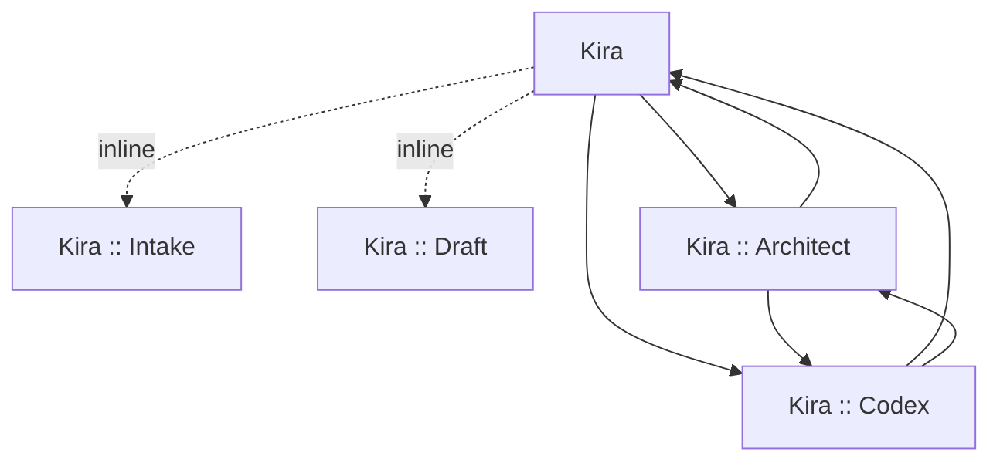

# Kira Workflow Asset Map

- Date: 2026-06-03
- Status: Implemented target map
- Purpose: document the simplified, portable, and cost-aware Kira customization surface.

## Fixed decisions

- Keep one main daily-driver agent named `Kira`.
- Keep helper subagents cheap and narrow: `Kira :: Intake` and `Kira :: Draft`.
- Keep expensive model usage explicit and user-visible through manual handoff-only agents.
- Add explicit coding handoff agents only when they map to a real user-facing choice.
- Keep reusable drafting and intake behavior in prompts and skills.

## Current repository tree

```text
copilot/
  agents/
    kira.agent.md
    kira-intake.agent.md
    kira-draft.agent.md
    kira-code.agent.md
    kira-architect.agent.md
    kira-codex.agent.md
  instructions/
    kira-core.instructions.md
    kira-drafting.instructions.md
    kira-csharp.instructions.md
  prompts/
    kira-create-adr.prompt.md
    kira-create-analysis.prompt.md
    kira-draft-commit.prompt.md
    kira-draft-pr.prompt.md
    kira-draft-ticket.prompt.md
    kira-refactor.prompt.md
  skills/
    kira-ticket-intake/
      SKILL.md
    kira-change-docs/
      SKILL.md
```

## Agent map

| Agent | Role | Model | Invocation |
|---|---|---|---|
| `Kira` | Daily planning, coding, validation, routing, lightweight review | `GPT-5.4 mini (copilot)` | Main agent |
| `Kira :: Intake` | Normalize request/ticket into compact intake packet | `GPT-5 mini (copilot)` | Inline subagent only |
| `Kira :: Draft` | Commit, PR, ADR, ticket, changelog, summary drafting | `GPT-5 mini (copilot)` | Inline subagent and user-invocable |
| `Kira :: Code` | Low-cost implementation and debugging handoff | `GPT-5.4 mini (copilot)` | Manual handoff only |
| `Kira :: Architect` | Deep architecture and risky decision review | `GPT-5.4 (copilot)` | Manual handoff only |

## Invocation constraints

- `Kira` may inline-call only `Kira :: Intake` and `Kira :: Draft`.
- `Kira` must not inline-call `Kira :: Architect`.
- `Kira :: Code` and `Kira :: Architect` are explicitly visible escalation paths.
- `Kira :: Architect` decides and recommends; `Kira` persists ADR/analysis files or implements follow-up work.
- Handoff prompts are instructions to the receiving agent, not the sending agent.

## Context packet format

Use this compact packet for handoff between modes or agents:

```markdown
# Agent Packet
## Task
## Goal
## Source Context
## Relevant Files
## Constraints
## Acceptance Criteria
## Work Already Done
## Validation Already Run
## Known Issues
## Requested Output
## Recommended Next Step
## Escalation Recommendation
```

For persisted architecture docs, the returning packet should also include recommended document paths and ADR-ready decision content.

## Draft packet format

When `Kira` calls `Kira :: Draft`, use:

```markdown
# Draft Packet
## Draft Type
## Goal
## Summary
## Changed Files
## Behavior Changes
## Validation Performed
## Risks Or Notes
## Tone
## Required Format
```

## Default workflows

- Simple coding task: `Kira` -> optional inline `Kira :: Intake` -> implement and validate in `Kira` -> optional inline `Kira :: Draft`.
- Planning task: `Kira` -> optional inline `Kira :: Intake` -> plan in `Kira` -> optional handoff to `Kira :: Architect`.
- Architecture-sensitive task: `Kira` -> optional inline `Kira :: Intake` -> manual handoff to `Kira :: Architect` -> return to `Kira`.
- Persisted ADR or analysis: `Kira` -> optional handoff to `Kira :: Architect` -> optional inline `Kira :: Draft` -> write files in `Kira`.
- Hard debugging: `Kira` attempts focused repair -> if a low-cost handoff is better, use `Kira :: Code`; if still insufficient, escalate manually to `Kira :: Architect`.
- Documentation-only: `Kira` -> inline `Kira :: Draft`.

## Escalation guidance

- Recommend `Kira :: Architect` for architecture boundaries, security/privacy, auth/permissions, API or schema decisions, or unclear long-term impact.
- Recommend `Kira :: Code` for low-cost implementation and debugging handoff.

## Handoff graph


